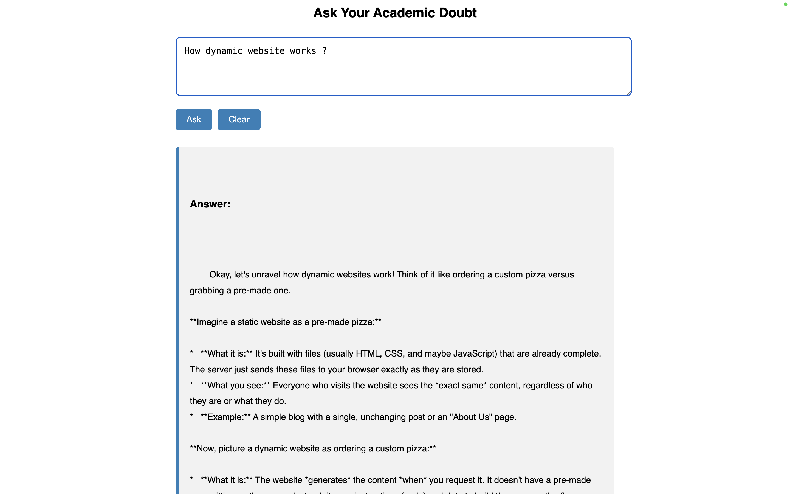
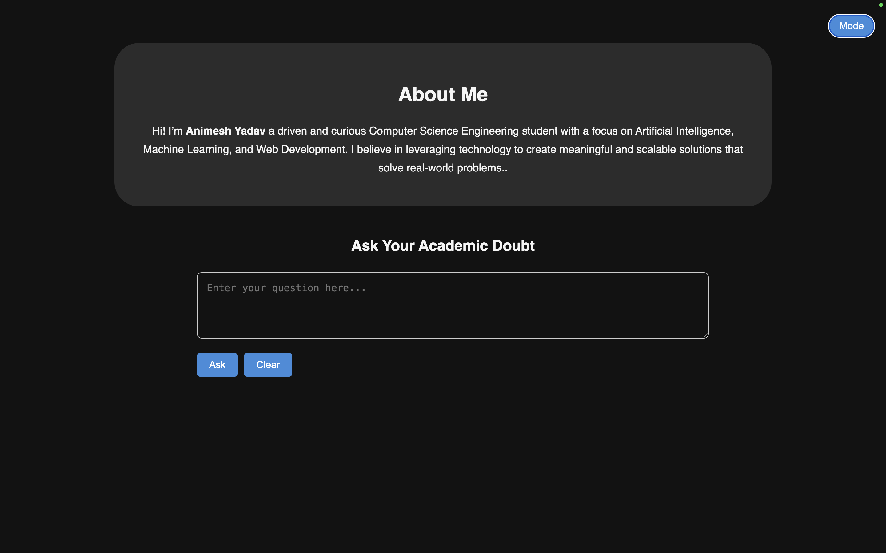
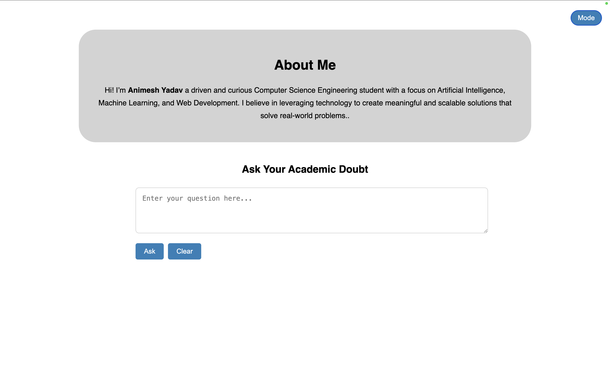

# 🧠 **Doubt Bot** 🤖

Welcome to **Doubt Bot** — an intelligent and interactive web-based assistant designed to answer your academic or general questions instantly using powerful AI. Whether you're a student, a curious learner, or just someone looking for quick answers, this tool is for you!





---

## 🚀 **Features**

- **Real-time Question Answering:** Type your question and get an instant response.
- **Minimal & Clean UI:** A user-friendly, elegant interface for smooth interaction.
- **Responsive Design:** Works on mobile, tablet, and desktop devices.
- **AI-Powered Engine:** Uses the latest large language models to give accurate and helpful answers.
- **Smart Input Handling:** Intelligently trims and validates your input.

---

## 🖥️ **Technologies Used**

This project combines modern web development with AI technologies:

### 🎨 Frontend:
- **HTML, CSS, JavaScript** – For structure, styling, and interactive experience.
- **Bootstrap** – Ensures responsiveness across devices.
- **Custom Styling** – A clean and aesthetic design using minimalist components.

### 🔧 Backend:
- **Django** – Powerful and scalable Python web framework.
- **Python** – Main language powering the logic and AI request handling.

### 🧠 AI Core:
- **Integrated AI Model** – Fetches intelligent answers from advanced language models.
- **Secure API Key Handling** – Keys are managed safely inside the server (in actual deployment, best kept secret).

---

## ⚙️ **Installation Guide**

Follow these simple steps to run the project locally:

### 1. Clone the Repository

```bash
git clone https://github.com/thisisanimesh01/Doubt_BOT.git
cd Doubt_BOT
